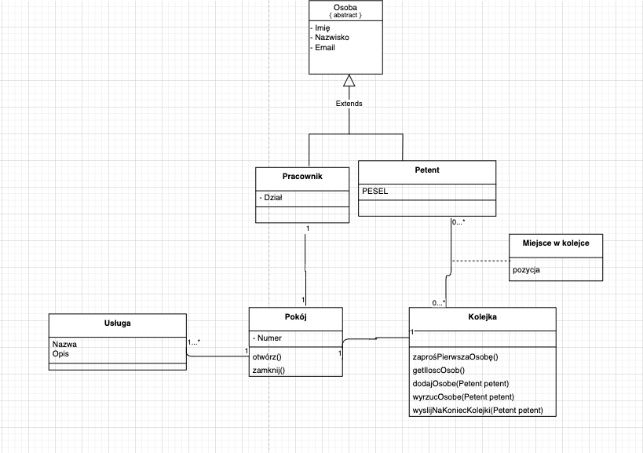

# Projekt zaliczeniowy z przedmiotu TIN

Autor:
* [Jakub Rusinowicz S17455](https://github.com/astrocodespace)

### Temat:
#### "Wirtualny urząd"

Tematem projektu jest aplikacja umożliwiająca urzędom przyjmowanie petentów w formie wideorozmowy online. Aplikacja powinna zawierać trzy typy użytkowników: Pracownik, Klient oraz Administrator, umożliwiać dodawanie, edycję oraz usuwanie obsługiwanych usług/spraw urzędowych dla których przechowywane będą dane takie jak Nazwa oraz Opis o których interesanci mogą porozmawiać z urzędnikiem.
Pracownik powinien mieć możliwość otworzenia pokoju do którego będzie przyjmował interesantów na wideorozmowę. Interesant/Klient powinien mieć możliwość zapisania się do kolejki w której będzie oczekiwał na zaproszenie do wideorozmowy.

Pracownik:
* Imię
* Nazwisko
* Adres email

Klient:
* Imię
* Nazwisko
* Adres email

Usługa:
* Nazwa
* Opis

Pokój:
* Usługi

Kolejka:
* Klienci

#### Model UML:

